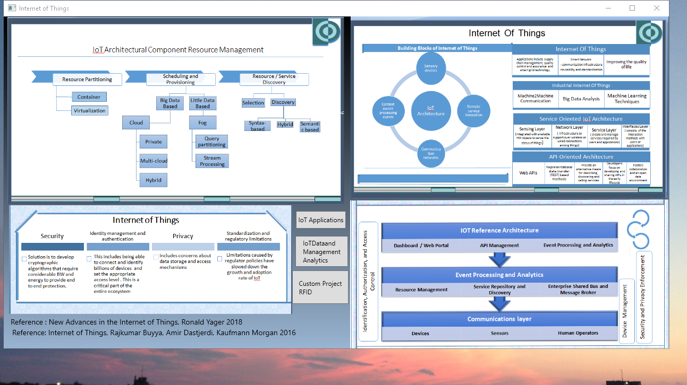
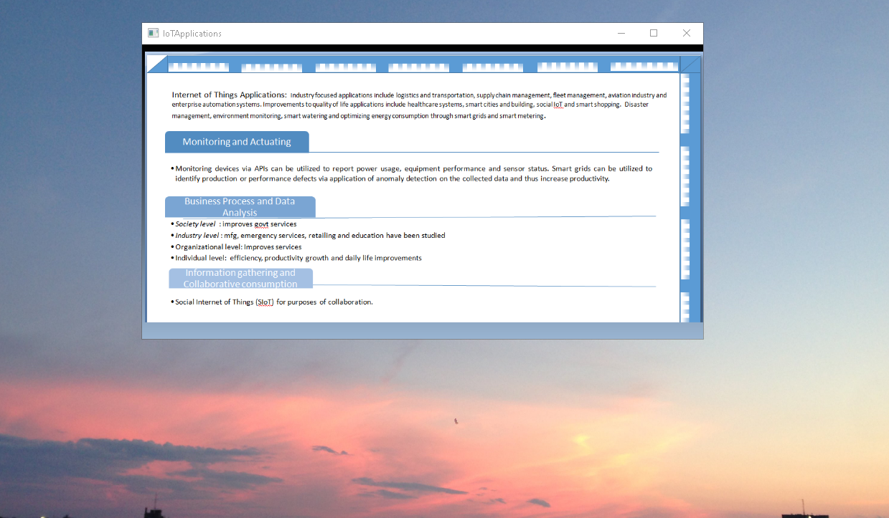
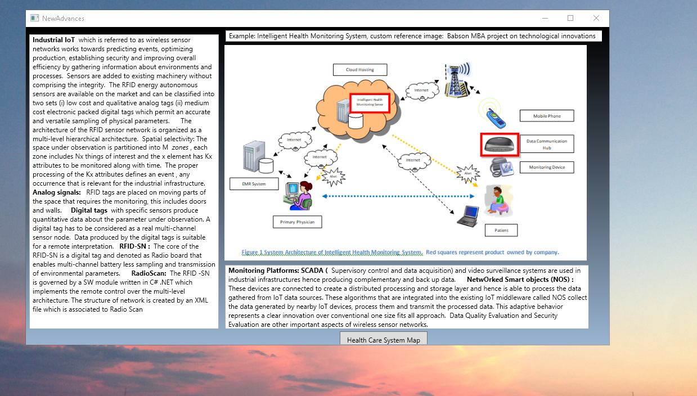

# Internet Of Things

The project focuses on providing an example of an IoT project in health care . For details, please click on the executable located in https://github.com/alpaddesai/InternetOfThings/releases. Company confidential information is not displayed. All images are either custom by Alpa D Desai or a reference name is included. Most of the images are custom. 

## IoT Architecture

## IoT Applications

## IoT Data Management Analytics

## RFID
### Team project - not a custom image.

## Health Care System

Advanced knowledge : https://github.com/alpaddesai/WirelessandMobileSystems , https://github.com/alpaddesai/BigDataDataScience, https://github.com/alpaddesai/DatabaseManagementDesign ,  https://github.com/alpaddesai/DataMining and https://github.com/alpaddesai/ObjectOrientedProgrammingCSharp.
